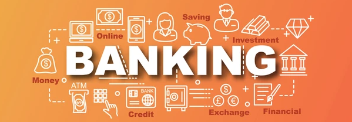

<h1 align="center">
  
</h1>

---

# Bank Interest Calcul

## Aperçu
Application web autonome pour produire un échéancier d’amortissement mensuel. On règle les paramètres du prêt (capital, taux, mensualité, frais, durée) **dans l’interface**, on clique sur _Calculer_, et le tableau mois par mois s’affiche instantanément. Tout est calculé localement dans le navigateur — aucune donnée n’est envoyée sur un serveur — et l’échéancier est exportable en CSV ou imprimable en PDF.

## Objectifs
- Fournir un tableau mois par mois avec la répartition : versement, intérêts, autres frais, capital remboursé et capital restant.
- Régler tous les paramètres avant l’exécution via une interface graphique simple.
- Afficher une synthèse (total versé, total intérêts, coût du crédit, mois d’extinction) et alerter si le prêt ne s’amortit pas.
- Offrir un export prêt à l’emploi (CSV ouvrable dans Excel / Google Sheets) et une impression PDF.

## Technologie
- HTML / CSS / JavaScript (page statique, sans dépendance ni build)

## Utilisation
Aucune installation : le projet est un simple fichier HTML.

- Ouvrez [`index.html`](./index.html) dans votre navigateur (double-clic), ou publiez-le via GitHub Pages.
- Renseignez les paramètres : **Capital de départ**, **Taux annuel**, **Mensualité**, **Autres frais mensuels** et **Durée maximale**.
- Cliquez sur **Calculer l’échéancier** → le tableau et la synthèse s’affichent.
- Exportez avec **Exporter en CSV** (séparateur `;`, ouvrable dans Excel) ou **Imprimer / PDF**.

> Les valeurs par défaut correspondent à un prêt d’exemple (3,4 % — 1 000 €/mois). Modifiez-les librement : l’interface prévient si la mensualité est trop faible pour amortir le prêt ou si le capital n’est pas éteint au terme de la durée choisie.

## Démo

## Auteur
- [Pierre-Portfolio](https://github.com/Pierre-Portfolio/)

---

Projet démarré en 2026 et mis à jour régulièrement.

